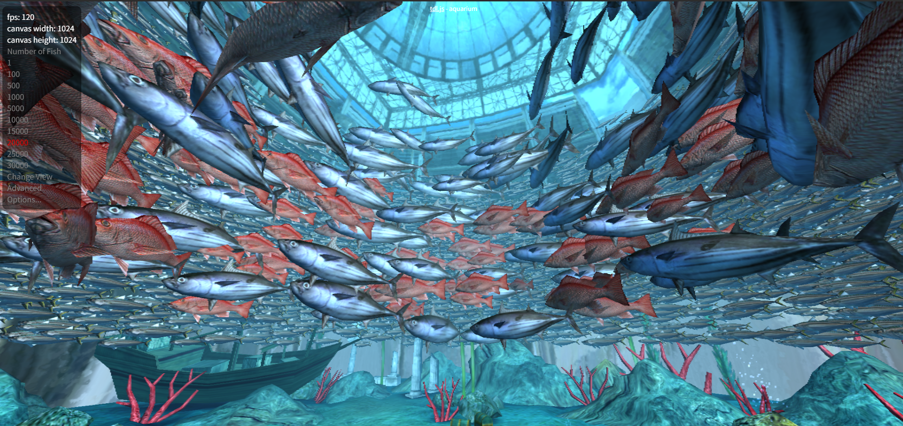

# GDCefGlue

A CEF (Chromium Embedded Framework) browser control for Godot 4.x using CefGlue.

[中文文档](README_CN.md)

## Features

- **Dual render mode**: OSR (off-screen rendering with alpha transparency) and EmbeddedWindow (native child window, higher performance)
- **Inspector property grouping**: Browser Settings / Feature Toggles / Embedded Mode
- **Dynamic property visibility**: OSR mode hides embedded-mode properties, EmbeddedWindow hides OSR-specific properties
- **Cross-platform embedded window**: Windows (Win32), Linux (X11), macOS (Cocoa)
- **Keyboard event forwarding**: Forward browser keyboard events to Godot in EmbeddedWindow mode
- GPU hardware acceleration support
- IME support for Chinese/Japanese/Korean input
- Popup handling
- Complete keyboard and mouse support
- Easy integration with Godot 4.x
- **JS ↔ C# bridge** via RegisterJavascriptObject (CEF IPC, no iframe needed)
- **GDScript bridge** via RegisterJsHandler (Callable-based, for GDExtension)

## Performance Demo

### WebGL Aquarium

Supports WebGL rendering with 20,000 fish at stable 120fps:



## Quick Start

### C# (Plugin)

Add a `CefGlueControl` node to your scene:

```csharp
var browser = new CefGlueControl();
browser.InitialUrl = "https://godotengine.org";
browser.Mode = RenderMode.OSR;        // OSR (transparent) or EmbeddedWindow
browser.Transparent = true;           // OSR only
AddChild(browser);
```

### GDScript (GDExtension)

```gdscript
var browser: CefGlueControl = $CefGlueControl
browser.InitialUrl = "https://godotengine.org"
browser.FrameRate = 120
browser.Mode = 0  # 0=OSR, 1=EmbeddedWindow

# Connect to signals
browser.BrowserInitialized.connect(_on_ready)
browser.AddressChanged.connect(_on_address_changed)
browser.LoadStart.connect(_on_loading)
browser.LoadEnd.connect(_on_done)
browser.LoadError.connect(_on_error)
```

## Requirements

- **Godot Engine**: 4.6.0 or later (with .NET/Mono support)
- **.NET SDK**: 8.0 or later
- **Windows**: x64 architecture (Linux/macOS also supported)

## Dependency Options

### Option 1: NuGet Package (Recommended)

The easiest way to use GDCefGlue. All necessary files are automatically copied during build.

**CEF 149 (Recommended):**
```xml
<ItemGroup>
  <PackageReference Include="CefGlue.Common" Version="149.7827.156" />
  <PackageReference Include="chromiumembeddedframework.runtime.win-x64" Version="149.0.4" />
</ItemGroup>
```

**CEF 120 (Official, not recommended — too old):**
```xml
<ItemGroup>
  <PackageReference Include="CefGlue.Common" Version="120.6099.0" />
  <PackageReference Include="chromiumembeddedframework.runtime.win-x64" Version="120.2.3" />
</ItemGroup>
```

### Option 2: Build from Source

If you need the latest version or want to customize CefGlue:

```bash
git clone https://github.com/youfch/CefGlue.git
```

Place the cloned repository in your project directory:
```
YourProject/
├── GDCefGlue/                    ← This repository
│   ├── plugin/                   ← Godot .NET project (addon source + demo)
│   │   └── addons/GCefGlue/     ←    CefGlueControl C# scripts
│   ├── extension/                ← GDExtension C# project (AOT native lib)
│   │   └── Dll/                  ←    godot-dotnet bindings
│   ├── test/GDExtensionGame/     ← Godot project for testing GDExtension
│   ├── Nuget/                    ← Local NuGet packages (LFS)
│   ├── img/
│   └── README*.md
└── CefGlue/                      ← Cloned CefGlue repository
```

## Project Structure

```
addons/GCefGlue/                    ← Plugin source code
├── CefGlueControl.cs               Skeleton (enum, fields, constructor)
├── CefGlueControl.Properties.cs    Export properties, static properties, events
├── CefGlueControl.Initialization.cs CEF init, lifecycle, browser creation
├── CefGlueControl.Rendering.cs     OSR paint, _Process, _Draw, cursor
├── CefGlueControl.Input.cs         Input forwarding, IME, _Notification
├── CefGlueControl.Bridge.cs        JS bridge, IPC, deserialization
├── CefGlueControl.Navigation.cs    Navigation, DevTools, CEF callbacks
├── CefGlueControl.Inspector.cs     Inspector property visibility (_ValidateProperty)
├── CefGlueControl.Events.cs        ForwardInputEvents event forwarding
├── CefGlueControl.Embedded.cs      Embedded window mode
├── CefInitializer.cs               CEF initialization
├── Handlers/                       CEF handlers
│   ├── GodotCefApp.cs
│   ├── GodotCefClient.cs
│   ├── GodotDisplayHandler.cs
│   ├── GodotLifeSpanHandler.cs
│   ├── GodotLoadHandler.cs
│   ├── GodotRenderHandler.cs
│   ├── GodotRequestHandler.cs
│   └── GodotBrowserProcessHandler.cs
└── Platform/                       Cross-platform native API
    ├── NativeWindowMethods.cs      Platform abstraction layer
    ├── X11Methods.cs               Linux X11 P/Invoke
    └── MacMethods.cs               macOS Cocoa P/Invoke
```

## Project Types

### GDExtension Project (Experimental)

Located in `extension/` directory. For Godot 4.6+.

**Features:**
- Uses Godot's GDExtension system
- Compiled as native AOT library
- Better performance and smaller file size
- Requires manual CEF file copying during export
- Entry point: `gdcefglue_library_init`

**Structure:**
- `extension/` - C# source code for GDExtension
- `extension/Dll/` - Godot .NET bindings (from [godot-dotnet](https://github.com/raulsntos/godot-dotnet))
- `test/GDExtensionGame/` - Godot project for testing

**Build Instructions:**

1. **Get Godot .NET Bindings:**
   ```bash
   git clone https://github.com/raulsntos/godot-dotnet.git
   cd godot-dotnet
   dotnet build -p:GenerateGodotBindings=true
   ```
   Copy the generated `Godot.Bindings.dll` and related files to `extension/Dll/`.

2. **CEF Dependencies (Cross-Platform):**
   - **Windows:** Automatically obtained via NuGet package `chromiumembeddedframework.runtime.win-x64`
   - **Linux:** Requires [cef.redist.linux](https://github.com/OutSystems/cef.redist.linux) dependency
   - **macOS:** Requires [cef.redist.osx](https://github.com/OutSystems/cef.redist.osx) dependency

3. **Build GDExtension:**
   ```bash
   cd extension
   dotnet publish -c Debug -r win-x64 --self-contained true
   ```

4. **Deploy:**
   Copy all files from `Debug/net10.0/win-x64/publish/` to `test/GDExtensionGame/lib/`.

5. **Run:**
   Open the project with Godot 4.6 and run.

### Normal C# Project

Located in `plugin/` directory. Traditional Godot C# project approach.

**Features:**
- Standard Godot .NET SDK project
- Uses `Godot.NET.Sdk`
- CEF files are automatically copied when using NuGet packages
- Source code in `addons/GCefGlue/`

**When to use:**
- If you prefer traditional Godot C# development
- If GDExtension doesn't meet your needs

Update your `.csproj` to reference the projects:
```xml
<ItemGroup>
  <ProjectReference Include="..\CefGlue\CefGlue\CefGlue.csproj" />
  <ProjectReference Include="..\CefGlue\CefGlue.Common\CefGlue.Common.csproj" />
  <ProjectReference Include="..\CefGlue\CefGlue.Common.Shared\CefGlue.Common.Shared.csproj" />
</ItemGroup>
```

### CefGlue Sources

| Source | CEF Version | Status | NuGet | GitHub |
|--------|-------------|--------|-------|--------|
| youfch/CefGlue | 149 | Maintained (Recommended) | `CefGlue.Common 149.7827.156` | [GitHub](https://github.com/youfch/CefGlue) |
| youfch/cef.redist.linux | 149 | Linux runtime | `cef.redist.linux64 149.0.4` | [GitHub](https://github.com/youfch/cef.redist.linux) |
| youfch/cef.redist.osx | 149 | macOS runtime | `cef.redist.osx64 149.0.4` | [GitHub](https://github.com/youfch/cef.redist.osx) |
| OutSystems/CefGlue | 120 | Official (Legacy) | `CefGlue.Common 120.6099.0` | [GitHub](https://github.com/OutSystems/CefGlue) |

## Build Instructions

### Using NuGet Package

```powershell
dotnet restore
dotnet build
```

### Using Source Code

```powershell
git clone https://github.com/youfch/CefGlue.git
dotnet restore
dotnet build
```

## Build Output

**Core Files:**
- `GDCefGlue.dll` - Main plugin assembly
- `Xilium.CefGlue.dll` - CefGlue wrapper
- `Xilium.CefGlue.Common.dll` - Common functionality

**CEF Native Files:**
- `libcef.dll` - Chromium core library
- `chrome_*.pak` - UI resources
- `resources.pak` - Application resources
- `locales\*.pak` - Language packs

**BrowserProcess Files:**
- `CefGlueBrowserProcess\` - Browser subprocess files

## Export for Distribution

When using NuGet packages, all necessary files are automatically copied during build. Just export your Godot project normally.

## CefGlueControl Properties

| Property | Type | Default | Group | Description |
|----------|------|---------|-------|-------------|
| `InitialUrl` | string | "about:blank" | Browser Settings | URL to load when browser is created |
| `Mode` | RenderMode | OSR | Browser Settings | Render mode: OSR / EmbeddedWindow |
| `FrameRate` | int | 60 | Browser Settings | Browser frame rate, 1-360 |
| `Transparent` | bool | false | Browser Settings | Enable transparent background (OSR only) |
| `GpuAcceleration` | bool | true | Feature Toggles | Enable GPU hardware acceleration |
| `OpenPopupInCurrentBrowser` | bool | true | Feature Toggles | Open popups in current browser |
| `SyncCursor` | bool | false | Feature Toggles | Sync cursor with web content (OSR only) |
| `ForwardInputEvents` | bool | false | Embedded Mode | Forward browser events to Godot (EmbeddedWindow only) |

### Dynamic Property Visibility

Properties automatically show/hide based on the selected `Mode`:

| Mode | Visible | Hidden |
|------|---------|--------|
| `OSR` | `SyncCursor`, `Transparent` | `ForwardInputEvents`, "Embedded Mode" group |
| `EmbeddedWindow` | `ForwardInputEvents`, "Embedded Mode" group | `SyncCursor` |

### RenderMode Enum

| Value | Description |
|-------|-------------|
| `OSR` (0) | Off-screen rendering. CEF renders to memory → Godot texture. **Supports transparency**. Cross-platform (Windows/Linux/macOS) |
| `EmbeddedWindow` (1) | Embedded native child window. CEF renders directly to OS window. **Better performance** (video/WebGL), **no transparency**. Cross-platform: Windows (Win32), Linux (X11), macOS (Cocoa) |

### ForwardInputEvents

When `Mode = EmbeddedWindow` and `ForwardInputEvents = true`, browser mouse/keyboard events are forwarded to Godot via IPC:

```
JS events → window.__godotEvents.forward(payload) → CEF IPC → C# → viewport.PushInput()
```

**Supported events:**

| Event | JS capture | Godot event |
|-------|-----------|-------------|
| `mouse_down` / `mouse_up` | `mousedown` / `mouseup` | `InputEventMouseButton` |
| `mouse_move` | `mousemove` | `InputEventMouseMotion` |
| `mouse_wheel` | `wheel` | `InputEventMouseButton(WheelUp/Down)` |
| `key_down` / `key_up` | `keydown` / `keyup` | `InputEventKey` |

**Coordinate mapping:** JS `clientX/clientY` (physical pixels) → Godot virtual pixels, respecting `ContentScale`.

### Static Properties

| Property | Type | Description |
|----------|------|-------------|
| `UseGpuAcceleration` | bool | Global GPU acceleration, must be set before CEF initialization |
| `UseTransparent` | bool | Global transparency setting, must be set before CEF initialization |

### Read-only Properties

| Property | Type | Description |
|----------|------|-------------|
| `Address` | string | Current page URL |
| `IsBrowserInitialized` | bool | Whether the browser is initialized |
| `IsLoading` | bool | Whether the page is loading |
| `Title` | string | Current page title |

## CefGlueControl Methods

| Method | Description |
|--------|-------------|
| `GoBack()` | Navigate back |
| `GoForward()` | Navigate forward |
| `NavigateToUrl(string url)` | Navigate to URL |
| `Reload(bool ignoreCache = false)` | Reload page |
| `ExecuteJavaScript(string code, ...)` | Execute JavaScript |
| `EvaluateJavaScript<T>(string code, ...)` | Execute JS and return result (C# only) |
| `EvalJs(string code)` | Async JS eval, result via `eval_completed` signal (GDScript) |
| `ShowDeveloperTools()` | Open DevTools |
| `CloseDeveloperTools()` | Close DevTools |

## JS ↔ C# Bridge

### C# (Plugin): RegisterJavascriptObject (Recommended) ✅

Register a C# object so JS can call its methods via V8 IPC (CEF SendProcessMessage).

**C# registration:**
```csharp
browser.RegisterJavascriptObject(new MyBridge(), "myBridge");
```

**JS call (returns Promise, use .then()):**
```javascript
window.myBridge.hello().then(function(result) {
    console.log(result);
}).catch(function(err) {
    console.error(err);
});
```

**C# → JS: evaluate and get result:**
```csharp
var title = await browser.EvaluateJavaScript<string>("document.title");
```

**C# → JS: push message:**
```csharp
browser.SendToJs("{\"type\":\"update\",\"payload\":{\"count\":42}}");
```

### GDScript (GDExtension): RegisterJsHandler

Register a GDScript Callable so JS can call it via V8 IPC.

**GDScript registration:**
```gdscript
browser.RegisterJsHandler("dotnetBridge", Callable(self, "_on_js_call"))
# Optional: specify method names (default: hello/echo/add/getVersion/eval)
browser.RegisterJsHandler("myBridge", my_handler, "[\"method1\",\"method2\"]")
```

**GDScript handler:**
```gdscript
func _on_js_call(method_name: String, args_json: String) -> Variant:
    match method_name:
        "hello":
            return "Hello from GDScript!"
        "add":
            var arr = JSON.parse_string(args_json) as Array
            return int(arr[0]) + int(arr[1])
```

**Async JS eval:**
```gdscript
browser.EvalJs("document.title")
# Result received via eval_completed signal:
browser.eval_completed.connect(_on_eval_result)
func _on_eval_result(result: String, error: String) -> void:
    print(result)
```

### API Overview

| API | Platform | Direction | Description | Status |
|-----|----------|-----------|-------------|--------|
| `RegisterJavascriptObject(target, name)` | Plugin | C# → JS | Register object callable from JS | ✅ Recommended |
| `RegisterJsHandler(name, Callable, methods)` | GDExtension | GDScript → JS | Register GDScript handler | ✅ Recommended |
| `EvaluateJavaScript<T>(code, ...)` | Plugin | C# → JS | Execute JS and return result | ✅ C# only |
| `EvalJs(code)` | Both | GDScript/C# → JS | Async JS eval via signal | ✅ GDScript |
| `SendToJs(json)` | Both | C#/GDScript → JS | Push message to JS | ✅ Active |
| `SendResponse(cbId, json)` | Both | C#/GDScript → JS | Reply to bridge request | ✅ Active |
| `BridgeRequest` event | Both | JS → C# | Bridge request entry | ✅ Active |
| `bridge_request` signal | GDExtension | JS → GDScript | Bridge request signal | ✅ Active |

## CefGlueControl Signals

| Signal | Parameters | Description |
|--------|-----------|-------------|
| `BrowserInitialized` | — | Browser initialization complete |
| `AddressChanged` | `url: string` | Current page URL changed |
| `TitleChanged` | `title: string` | Page title changed |
| `LoadStart` | — | Page starts loading |
| `LoadEnd` | — | Page finishes loading |
| `LoadError` | `errorText, failedUrl` | Page failed to load |
| `eval_completed` | `result, error` | EvalJs result (GDExtension) |
| `bridge_request` | `type, payload, cbId` | Bridge request (GDExtension) |

## GPU Configuration

```csharp
// Enable GPU acceleration (default) - set in inspector
// GpuAcceleration = true;

// Disable GPU acceleration (software rendering) - set in inspector
// GpuAcceleration = false;
```

**Note:** This property is exposed to the Godot inspector. Set it before the control is initialized.

## Troubleshooting

### GPU Process Crashed
1. Ensure all CEF files are copied correctly
2. Try disabling GPU acceleration in the inspector

### Missing DLLs
1. Run `dotnet restore`
2. Clean and rebuild the solution

### Blank Page
1. Check if `locales` directory exists
2. Ensure `resources.pak` is present

## Known Issues

1. **Right-click Context Menu**: Not supported
2. **Network Notification**: `WSALookupServiceBegin failed with: 10108` is a normal warning
3. **Embedded window focus**: Clicking a Godot input after CEF may not release keyboard focus. Auto-handled via platform-specific APIs.
4. **JS Bridge S prefix**: CefGlue's serialization protocol prepends 'S' marker to strings. Automatically stripped.

## License

GDCefGlue is licensed under the MIT License. See [LICENSE](LICENSE) for details.

Third-party dependencies:
- [CefGlue](https://github.com/youfch/CefGlue) - BSD-3-Clause
- [CEF](https://bitbucket.org/chromiumembedded/cef) - BSD-3-Clause
- [Godot Engine](https://godotengine.org) - MIT
- [godot-dotnet](https://github.com/raulsntos/godot-dotnet) - MIT